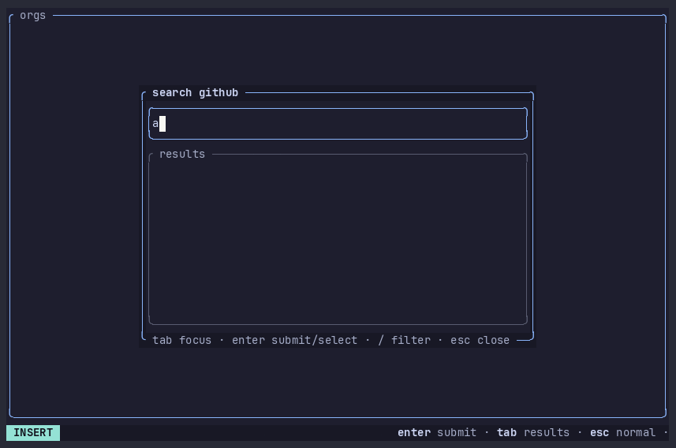

# ghx

ghx is a modal terminal UI (ratatui) for browsing remote GitHub
repositories: a yazi-style miller-column browser (org, repo, directory,
file) with a syntax-highlighted preview pane, running against the
GitHub REST API and a local content-addressed cache. No clone is
required — files open read-only in your editor, browser URLs yank to
the clipboard, and a full-screen search view finds files and greps
content. Other backends plug in as stdio provider processes
([doc/provider-protocol.md](doc/provider-protocol.md)).



## Flows

### Browse

On a fresh install ghx opens on the repo search popup; `␣ s` reopens
it at any time, prefilled with the last repo (Enter resumes it).
`ghx owner/repo` skips the popup entirely.

```
type query, Enter   search GitHub (orgs + repos)
j / k               move               h / l   focus out / drill in
J / K               scroll the preview
/                   filter the focused pane (Enter commits, Esc cancels)
Enter               open: file → editor (read-only), dir/repo/org → drill in
?                   keybinds popup     :   command line     q  quit
```

### Find and grep (global search view)

`␣ f` (find file by path) and `␣ g` (grep contents) open a
full-screen search that replaces the browser until closed.

```
Tab / BackTab       cycle query → scope → extension → results
Enter               in a text field: run the search
j / k on scope      cycle repo / org / global
Enter on scope      radio popup: j/k/g/G move and apply live,
                    Enter commits, Esc reverts
j / k on results    move between hits        J / K   free scroll
/                   filter results by path or preview text
Enter on results    open the hit in the editor (read-only)
Esc                 close the view; the browser is untouched underneath
```

Repo-scope file find runs over the cached tree with no API call.
Grep and global file find use code search, which requires a token.

### Clone

`v` enters VISUAL mode; `␣` marks entries (file/dir marks fold up to
their repo). `:clone` opens a three-screen wizard: repos, destination,
summary.

```
␣                   toggle a repo checkbox
Tab                 list ↔ buttons            j / k   move
l / Enter on dirs   descend (destination)     h       go up
Enter on [clone!]   git clone into <dest>/<repo>
Esc                 cancel the whole wizard from any screen
```

With no marks, `:clone` offers every repo of the selected org. Clones
run sequentially on a worker thread; the modeline reports the outcome.

## Install

Each tagged release publishes a static Linux x86_64 musl binary and
its sha256 ([releases](https://github.com/tknawara/ghx/releases));
download, `chmod +x`, run. Build from source with Docker (exports
`./dist/ghx-linux-x86_64-musl`):

```
docker compose run --build --rm release
```

## Auth

Token resolution, first match wins (`src/github/client.rs`):

1. `GHX_TOKEN`
2. `GITHUB_TOKEN`
3. `gh auth token`
4. anonymous

Anonymous use can browse. Code search (`␣ g`, and `␣ f` outside repo
scope) fails with a message telling you to set a token.

## Configuration

`~/.config/ghx/config.toml` — missing or malformed falls back to
defaults; editable in the app via `:settings`, which writes the file
back and hot-reloads the theme:

```toml
[editor]
program = "nvim"      # optional; default $VISUAL → $EDITOR → hx/nvim/vim/vi
args = []
read_only = true      # adds -R for the vim family

[theme]
name = "catppuccin-mocha"  # overrides in ~/.config/ghx/themes/<name>.toml

[cache]
max_mb = 512          # blob cache cap; LRU eviction + orphan sweep at startup

[provider]
kind = "github"       # or "stdio"
command = []          # argv, used when kind = "stdio"
```

## Providers

The GitHub backend is one implementation of a provider seam: any
source-control system can be wrapped as a child process speaking
NDJSON-RPC 2.0 over stdio (`examples/providers/fs_provider.py` is the
reference adapter). Spec: [doc/provider-protocol.md](doc/provider-protocol.md).

## Development

```
cargo test                          # unit + TestBackend render tests
cd e2e && uv run pytest             # PTY end-to-end suite
docker compose run --build --rm test  # fmt + clippy -D warnings + cargo test
docker compose run --build --rm e2e # same e2e suite in a container
```

Further docs: [doc/getting-started.md](doc/getting-started.md) (first
run, key map, state/cache/config locations),
[doc/development.md](doc/development.md) (architecture, dev workflow,
e2e harness) and [doc/house-style.md](doc/house-style.md) (the
component contract).
