# Getting started

## Install

Grab the static musl binary from
[github.com/tknawara/ghx/releases](https://github.com/tknawara/ghx/releases)
(each release ships `ghx-linux-x86_64-musl` plus a `.sha256`), or build
it in Docker — the release stage exports the same binary to `./dist/`:

```
docker compose run --build --rm release
```

## Auth (optional but recommended)

ghx resolves a GitHub token in this order — set any one of them:

```
export GHX_TOKEN=ghp_...      # or GITHUB_TOKEN, or log in with: gh auth login
```

Anonymous use works for browsing and previews. Code search (`␣ g`, and
`␣ f` outside repo scope) requires a token and says so otherwise.

## First run

Launch with no arguments:

```
ghx                # search popup on a fresh install
ghx owner/repo     # skip the popup, open a repo directly
ghx --theme NAME   # override the theme for this session
ghx --config PATH  # use a different config file
```

The search popup appears only when state is fresh (no recent repos or
orgs). Type a query and press Enter; results list orgs first, then
repos. `j/k` move, Enter opens. On every later launch the browser opens
directly with your recent orgs/repos; `␣ s` reopens the search popup,
prefilled with the last repo — Enter alone resumes it.

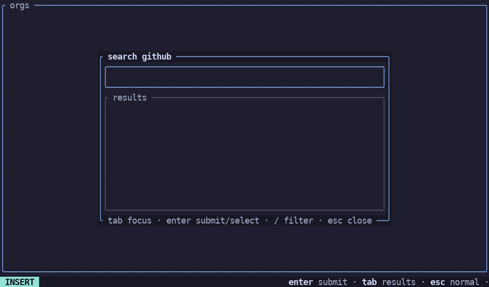

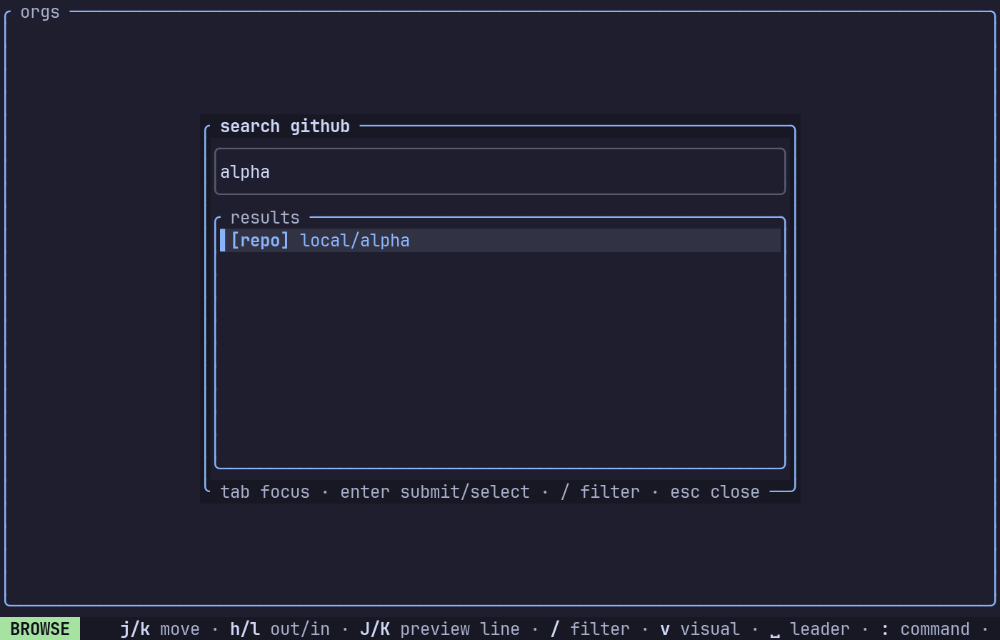

## Key map essentials

```
j / k / h / l     move, focus out, drill in      J / K   scroll preview
/                 filter the focused pane         Enter  open selection
␣ s               repo/org search popup           ␣ f    find file
␣ g               grep contents                   ␣ y    yank URL
v                 VISUAL multi-select             ␣ c    clear marks
:                 command line                    ?      keybinds popup
q                 quit
```

Every key is listed in the `?` popup — the same tables that drive
dispatch generate it, so the two cannot drift.

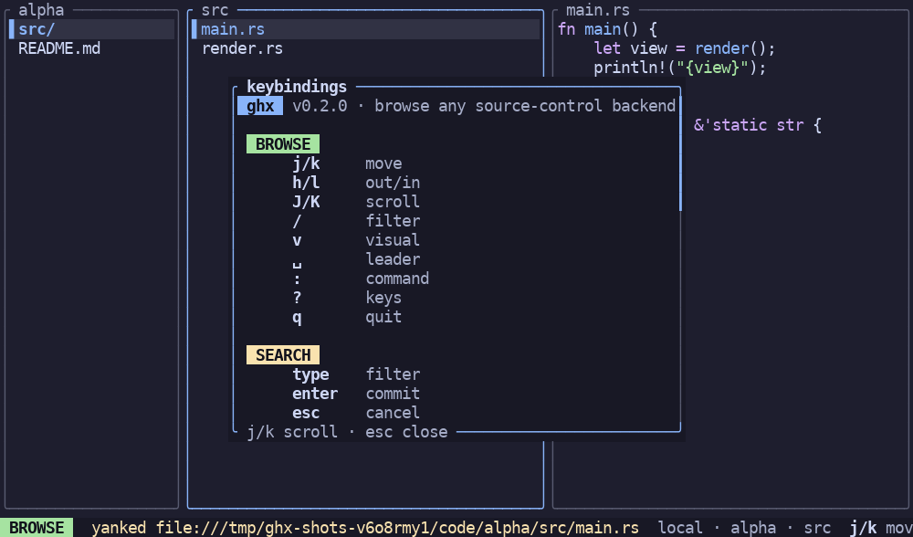

## Find and grep (`␣ f` / `␣ g`)

Full-screen search replaces the browser: a field row on top (query ·
scope · extension), Zed-style result blocks below — path + match-count
badge, syntax-highlighted preview lines with real line numbers, and
matched text chipped in yellow. `Tab` cycles fields, `Enter` runs the
search and focuses results, `j/k` move between blocks, `/` filters the
results locally, `Enter` on a hit opens it in your editor.

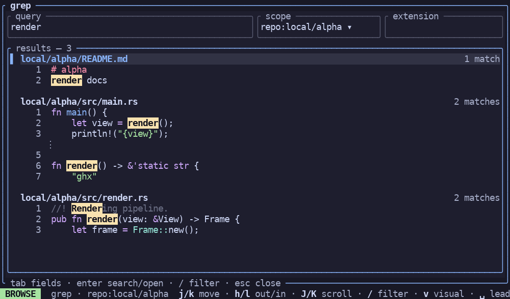

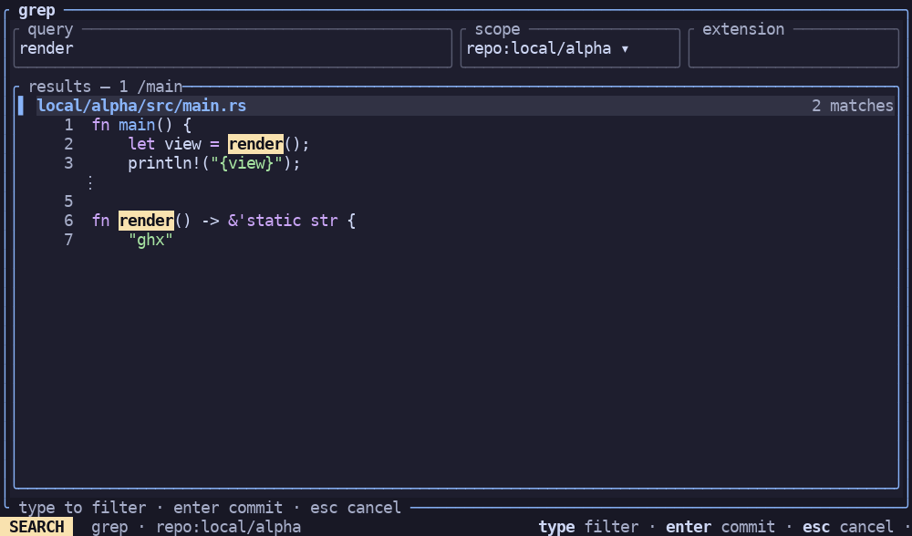

Scope waterfalls from where you are — an open repo defaults to
`repo:`, a selected org to `org:`, otherwise `global`. `j/k` on the
scope field cycles directly; `Enter` opens the radio popup where the
selection follows the cursor live (`Esc` reverts).

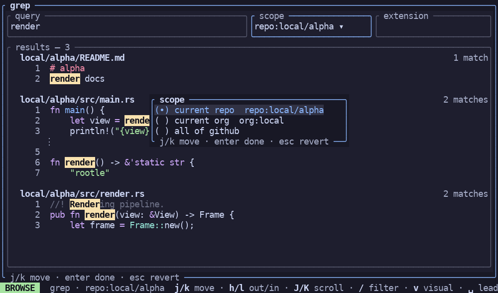

In any popup or search view: `Tab` moves between fields, `Enter`
submits, `Esc` steps back. Text inputs are modal like vim: Esc in
INSERT drops to NORMAL (`h/l/0/$/x`, `i/a/A` to re-enter INSERT).

## Open a file in your editor

Move the cursor onto a file and press `Enter`. ghx materializes the
cached blob under `~/.cache/ghx/edit/<owner>__<repo>/<path>`, suspends
the terminal, and runs your editor on it. Edits are never written back.

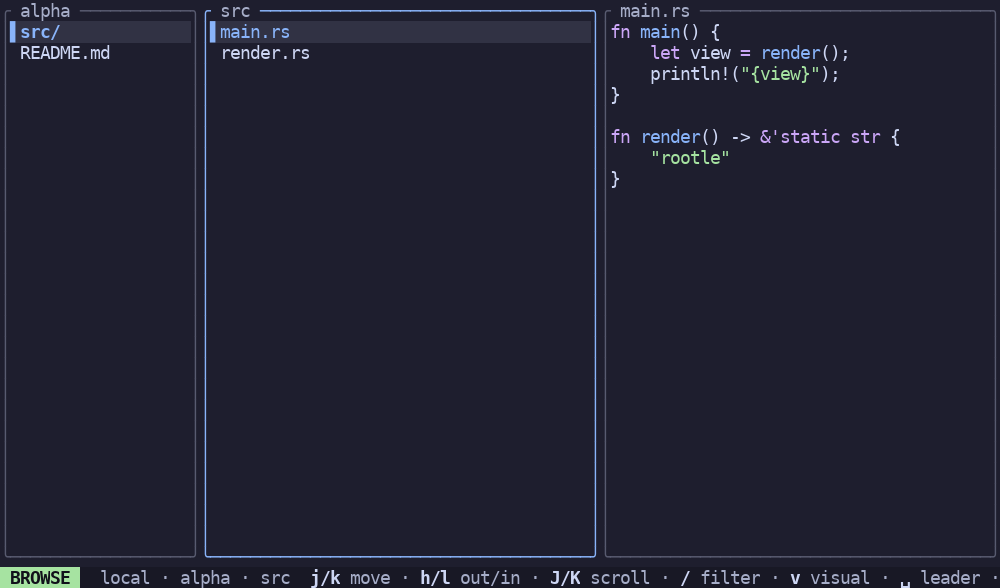

Editor resolution: `[editor].program` in config.toml, then `$VISUAL`,
then `$EDITOR`, then the first of `hx`, `nvim`, `vim`, `vi` on PATH. With `read_only = true` (the default) the vim
family is started with `-R`. The same flow opens search-view hits.

## Yank a URL (`␣ y`)

Copies the browser URL for whatever is under the cursor to the
clipboard and confirms in the modeline ("yanked …"):

- repo level — the repo URL; org level — the org URL
- file/dir — the blob/tree URL for that path
- search view — the hit's URL, with a `#L<line>` fragment for the
  matched line

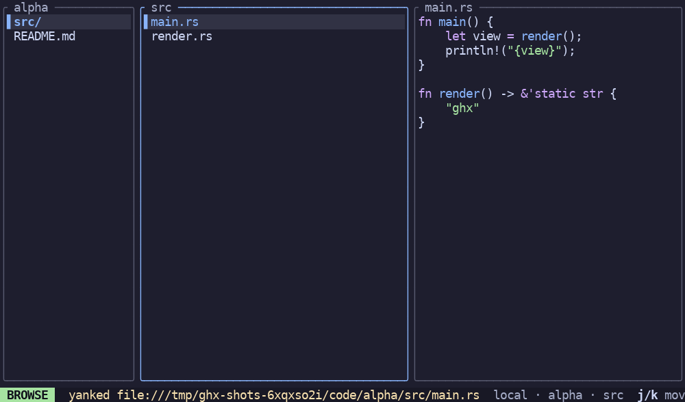

Clipboard: OSC 52 first (works over SSH and tmux), then a local tool
(`wl-copy`, `xclip`, `xsel`, `pbcopy`). `GHX_CLIPBOARD=<path>`
redirects yanks to a file for scripts and CI.

## The command line (`:`)

`:` opens a strip above the modeline with a filtered option list:

- `:settings` — tabs per config section (`[editor]`, `[theme]`,
  `[cache]`); Tab/h/l switch tabs, j/k move, Enter edits a value in
  place, Esc closes (a dirty popup saves config.toml and hot-reloads
  the theme).
- `:clone` — the clone wizard over VISUAL marks (see README).

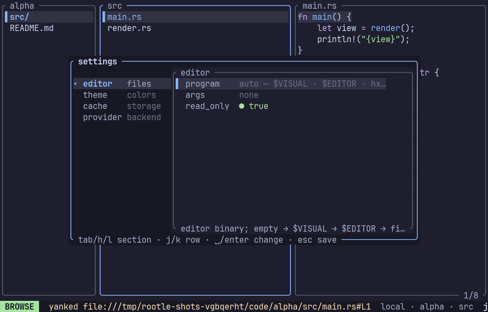

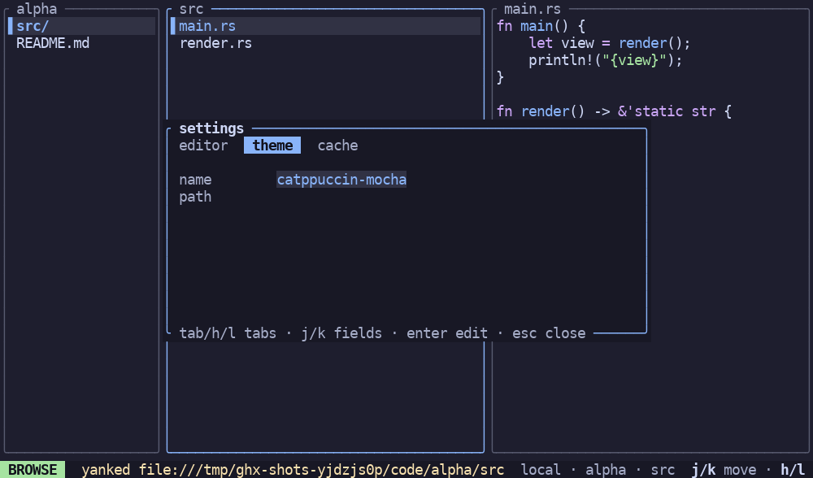

### Clone wizard (`v` + `:clone`)

`v` in browse mode enters VISUAL: `Space` marks entries (green ●).
Marks **persist after leaving VISUAL** (the ● stays) — they drive
`:clone` and `␣ d`. `␣ c` clears them all.

- `:clone` resolves marks to repos — files fold up to their repo,
  a marked org expands down to its repos — and walks three screens:
  repo checkboxes, a destination mini-browser over your local folders,
  and a summary with the exact commands. Repos clone into
  `<dest>/<org>/<repo>` so same-named repos never collide. `Esc`
  cancels the wizard from any screen; `:` works from inside VISUAL.
- `␣ d` deletes marked **orgs** from the orgs pane (and your recents)
  — the way to clean up orgs you no longer browse.

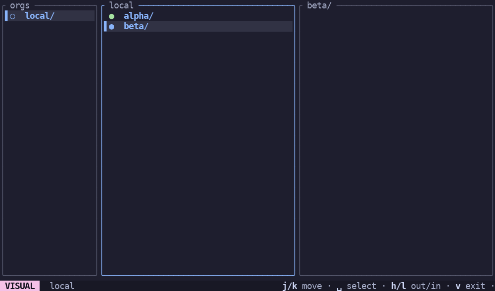

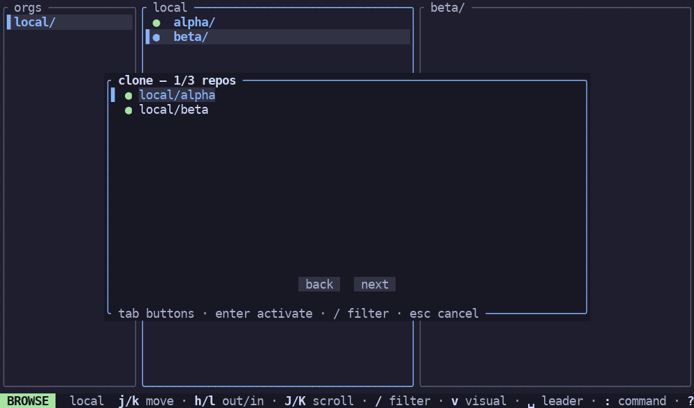

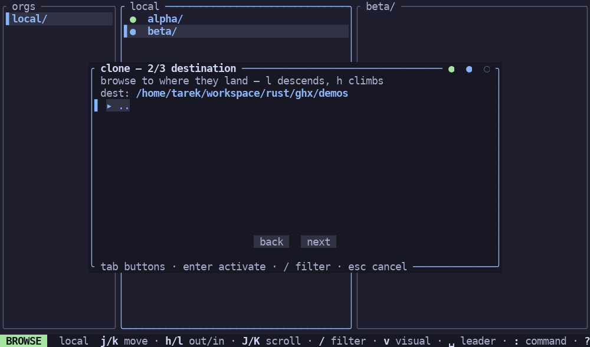

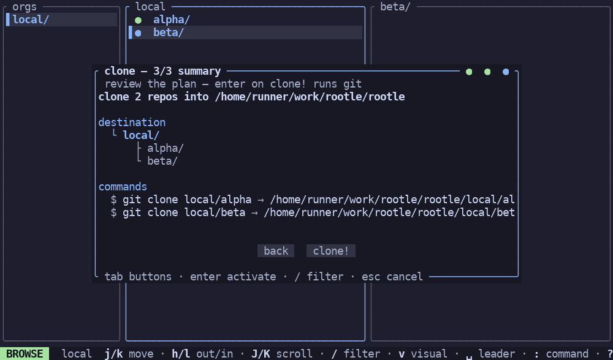

## Where things live

| Path | Contents |
|---|---|
| `~/.config/ghx/config.toml` | configuration |
| `~/.config/ghx/themes/<name>.toml` | palette overrides (`[semantic]` role = hex) |
| `~/.local/state/ghx/state.json` | recents, last org/repo/path, last search scope/extension |
| `~/.cache/ghx/` | content-addressed cache (safe to delete anytime) |

Cache layout: `trees/<sha>.json` (immutable repo trees), `blobs/<ab>/<rest>`
(blobs sharded by the first two sha chars), `index/refs/<owner>/<repo>/<branch>`
(rev → tree sha + etag, revalidated on open), `edit/` (materialized files).
At startup ghx sweeps orphans and evicts least-recently-used blobs past
`[cache].max_mb` (default 512). Deleting `~/.cache/ghx` is always safe;
state and config are separate files.

## Next

- [provider-protocol.md](provider-protocol.md) — run ghx against your
  own backend via a stdio provider.
- [settings.md](settings.md) — every config key, theme role, env
  variable, and CLI flag.
- [development.md](development.md) — architecture, dev workflow, and
  the test harness, for contributors.
- [house-style.md](house-style.md) — the component contract.
